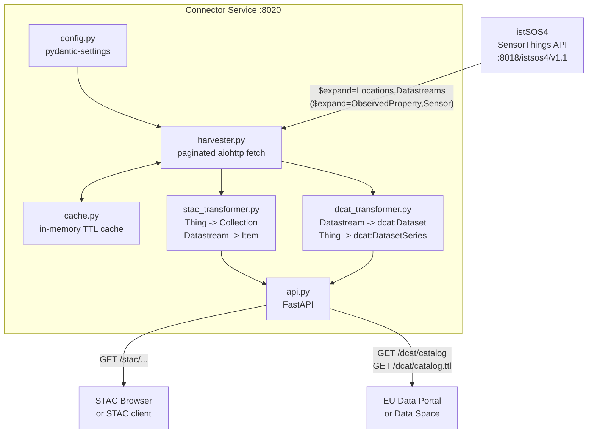

# istSOS Metadata Connector

A standalone FastAPI microservice that harvests metadata from an [istSOS4](https://github.com/istSOS/istSOS4) deployment and exposes it through two open catalog standards:

- **STAC 1.0**: SpatioTemporal Asset Catalog, for geospatial discovery and eoAPI STAC browser integration
- **DCAT-AP 3.0**: EU Application Profile of DCAT, for European data space and open data portal interoperability

Built as part of [Google Summer of Code 2026](https://summerofcode.withgoogle.com/programs/2026/projects/UmLEBaWM) with [OSGeo / istSOS](https://www.osgeo.org/).  
Supporting the FAIR-by-design sensor infrastructure described in Strigaro et al. (EGU26-11300) and Cannata et al. (EGU26-9152).

---

## What it does

istSOS4 exposes rich environmental and IoT sensor data through the OGC SensorThings API (STA). The metadata describing that data .i.e, what is measured, where, by which sensors, over what time period, is invisible to standard catalog infrastructure. Researchers at other institutions, government data portals, and EU data space infrastructure have no standard way to discover what an istSOS4 deployment contains.

This connector bridges that gap. It harvests the STA entity graph, transforms it into both catalog formats, and serves live queryable endpoints that any STAC browser or EU open data portal can point at directly, without requiring any changes to the istSOS4 instance itself.

---

## Architecture



---

## Mapping model

The connector maps OGC SensorThings entities to both catalog formats using a shared pivot rule. The documentations to be made in [`docs/metadata_connector/`]() in the upcoming weeks.

---

## API endpoints

### STAC

| Method | Path | Description |
|---|---|---|
| `GET` | `/stac` | Root STAC Catalog, entry point for STAC browsers |
| `GET` | `/stac/collections` | All Collections (one per Thing) |
| `GET` | `/stac/collections/{collection_id}` | Single Collection having ID format: `thing-{iot_id}` |
| `GET` | `/stac/collections/{collection_id}/items` | All Items (one per Datastream) in a Collection |
| `GET` | `/stac/collections/{collection_id}/items/{item_id}` | Single Item having ID format: `datastream-{iot_id}` |

All STAC endpoints return `Content-Type: application/json`.

### DCAT-AP 3.0

| Method | Path | Format | Description |
|---|---|---|---|
| `GET` | `/dcat/catalog` | `application/ld+json` | Full DCAT-AP 3.0 catalog as JSON-LD |
| `GET` | `/dcat/catalog.ttl` | `text/turtle` | Full DCAT-AP 3.0 catalog as Turtle |

Format selection is URL-based, not via `Accept` header negotiation.

### Utility

| Method | Path | Description |
|---|---|---|
| `GET` | `/health` | Returns `{"status": "ok", "sta_base_url": "..."}` |
| `GET` | `/cache/status` | Cache state containing TTL remaining and thing count |
| `DELETE` | `/cache` | Force cache flush, triggering a fresh harvest on the next request |

The `/cache` is going to be hid behind an auth layer in production.

OpenAPI docs will be available at `/docs` (Swagger UI) and `/redoc`.

---

## Steps to run as dev

First clone the repo
```bash
git clone https://github.com/Vishmayraj/istSOS4-MetadataConnector.git
cd istSOS4-MetadataConnector
```

Set up the venv
```bash
# For Windows
python -m venv .venv
.venv\Scripts\activate
```

```bash
# For Linux
python3 -m venv .venv
source .venv/bin/activate
```

Then run the server at default configurations for a dev environment
```bash
# TO BE CONTINUED
```

---

## Running tests

```bash
pytest tests/ -v
```

The test suite covers all mandatory DCAT-AP field mappings, all STAC object types, and edge cases including Things with no Location, Datastreams with no `phenomenonTime`, open-ended temporal intervals, and missing mandatory config.

---

## Project structure

```
MetadataConnector/
├── connector/
│   ├── api.py                  # FastAPI app: STAC + DCAT + utility endpoints
│   ├── harvester.py            # Paginated aiohttp STA fetch; HarvestedCatalog dataclass
│   ├── stac_transformer.py     # STA -> pystac objects (Thing -> Collection, Datastream -> Item)
│   ├── dcat_transformer.py     # STA -> rdflib Graph (DCAT-AP 3.0, JSON-LD + Turtle)
│   ├── cache.py                # In-memory TTL cache (key-value, monotonic clock)
│   ├── config.py               # pydantic-settings -> single source of truth for all config
│   ├── exceptions.py           # HarvesterError hierarchy
│   └── utils.py                # fetch_with_retry (aiohttp + exponential backoff), build_cache_key
├── docs/
│   ├── metadata_connector/
│   │   ├── Harvesting-Layer-Reference.md      # In-depth docs
│   │   ├── STA-STAC-Mapping-Reference.md
│   │   ├── Configuration-Reference.md
│   │   ├── API-Layer-Reference.md
│   │   └── STA-DCAT-AP-Mapping-Reference.md
├── tests/
│   ├── conftest.py
│   ├── test_harvester.py
│   ├── test_stac_transformer.py
│   └── test_dcat_transformer.py
├── Dockerfile
├── docker-compose.yml
├── .dockerignore
├── .gitignore
├── .env.example
├── requirements.txt
└── requirements-test.txt
```

---


## License

Apache 2.0 - see [LICENSE](LICENSE).

## Acknowledgements

Developed as part of Google Summer of Code 2026 with OSGeo (istSOS).  
Mentors: Claudio Primerano (primary), Massimiliano Cannata, Daniele Strigaro - SUPSI, Switzerland.